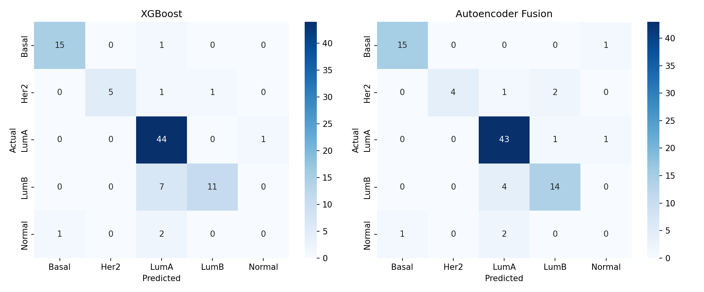
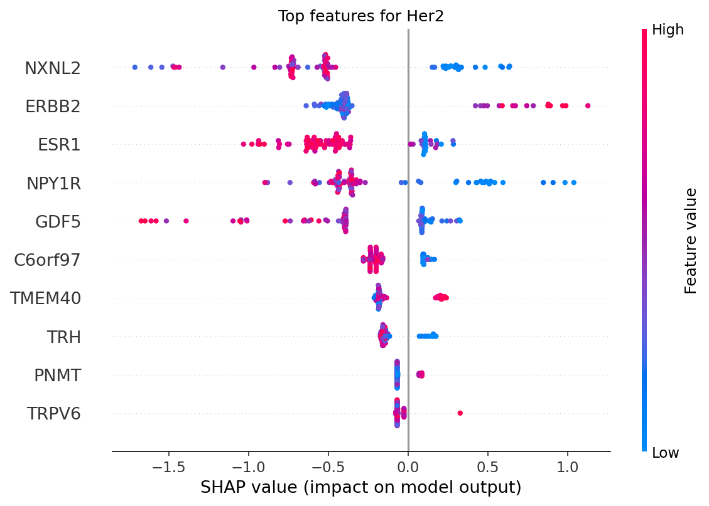

# Multi-Omics Integration for Breast Cancer Molecular Subtype Classification

## Motivation

Breast cancer is not a single disease — it comprises molecularly distinct 
subtypes that differ in biology, prognosis, and treatment response. The PAM50 
gene signature classifies tumors into five subtypes (Luminal A, Luminal B, 
HER2-enriched, Basal-like, Normal-like), and this classification directly 
informs clinical decisions: hormone receptor-positive subtypes (LumA/LumB) 
respond to endocrine therapy, HER2-enriched tumors are treated with 
HER2-targeted agents (e.g., trastuzumab), and Basal-like tumors typically rely 
on chemotherapy due to lack of targetable receptors.

This project builds an end-to-end machine learning pipeline that predicts PAM50 
subtype from two molecular data layers — gene expression and somatic mutation 
profiles — using real patient data from The Cancer Genome Atlas (TCGA). The 
goal is to demonstrate a complete multi-omics integration workflow: from raw 
data acquisition through model comparison, biological interpretation, and 
deployment, reflecting the kind of analysis used in precision oncology research.

## Data Source

All data was obtained from [UCSC Xena](https://xenabrowser.net), which hosts 
processed TCGA datasets as analysis-ready flat files.

| Data type | Dataset | Patients | Features |
|---|---|---|---|
| Gene expression | IlluminaHiSeq RNA-seq (log2 RSEM normalized) | 1,218 | 20,530 genes |
| Mutation | MC3 gene-level non-silent mutation calls (binary) | 791 | 40,543 genes |
| Clinical | TCGA-BRCA phenotype file (PAM50Call_RNAseq label) | 1,247 | — |

After identifying patients with complete data across all three sources and a 
valid PAM50 label, the final analysis cohort was **593 patients**.

**Class distribution** (showing substantial imbalance, addressed via class 
weighting throughout):

| Subtype | Count |
|---|---|
| Luminal A | 301 |
| Luminal B | 125 |
| Basal-like | 106 |
| HER2-enriched | 42 |
| Normal-like | 19 |

## Pipeline

### 1. Data Alignment
Expression and mutation matrices (originally gene × patient) were transposed 
to patient × gene and intersected by patient ID with the clinical labels, 
producing three aligned datasets of 593 patients each, verified to match 
row-for-row.

### 2. Feature Selection
- **Expression**: Reduced from 20,530 to 2,000 genes via variance thresholding 
  (retaining the most variable, and therefore most discriminative, genes). 
  A post-hoc audit found that this purely statistical method had excluded 
  **ERBB2** (the HER2 gene) and **MKI67** (a key proliferation marker 
  distinguishing LumA from LumB) — both clinically essential to PAM50 
  itself. These two genes were added back explicitly, bringing the final 
  expression feature set to 2,002 genes.
- **Mutation**: Reduced from 40,543 to 2,714 genes by retaining only those 
  mutated in at least 1% of the cohort, removing uninformative all-zero or 
  near-zero-variance columns.

### 3. Preprocessing
Expression values were z-score standardized (required for the neural network 
model; tree-based models are scale-invariant). Mutation features, being 
binary, were left unscaled. Data was split into train/validation/test sets 
(70/15/15) with stratification to preserve subtype proportions across splits.

### 4. Modeling — Two Approaches

**Model A: XGBoost (gradient-boosted trees)**
Expression and mutation features were concatenated into a single feature 
matrix ("late fusion") and passed to an XGBoost classifier, trained with 
class-balanced sample weights to counteract subtype imbalance.

**Model B: Multi-Omics Autoencoder Fusion (deep learning)**
A more structured architecture: independent encoder-decoder pairs compress 
each omics layer into a 32-dimensional latent representation, while a 
reconstruction loss ensures these representations retain meaningful biological 
structure rather than overfitting purely to the classification task. The two 
latents are concatenated into a 64-dimensional fused representation, which 
feeds a classifier head predicting PAM50 subtype. The model is trained jointly 
on a combined reconstruction + classification loss, with early stopping based 
on validation accuracy to mitigate overfitting given the modest sample size 
(415 training patients for a several-thousand-parameter model).

### 5. Evaluation and Interpretation
Both models were evaluated on a held-out test set (89 patients) using 
per-class precision/recall/F1 (preferred over raw accuracy given class 
imbalance) and confusion matrices. An ablation study tested the autoencoder 
model with each omics modality individually disabled, to quantify each 
layer's independent contribution. SHAP (SHapley Additive exPlanations) 
analysis was applied to the XGBoost model to identify which genes most 
influenced predictions for each subtype.

## Results

### Model Comparison

| Model | Accuracy | Macro F1 |
|---|---|---|
| XGBoost, variance-selected features only | 81% | 0.64 |
| XGBoost, + ERBB2/MKI67 markers | 84% | 0.68 |
| Autoencoder Fusion (with early stopping) | 85% | 0.67 |

### Per-Class Performance (Final Models)

| Subtype | XGBoost F1 | Autoencoder F1 |
|---|---|---|
| Basal | 0.94 | 0.94 |
| Her2 | 0.83 | 0.77 |
| LumA | 0.88 | 0.90 |
| LumB | 0.73 | 0.81 |
| Normal | 0.00 | 0.00 |

### Ablation: Modality Contribution

| Input to Autoencoder | Accuracy |
|---|---|
| Expression + Mutation (full model) | 85.4% |
| Expression only | 85.4% |
| Mutation only | 45.0% |

## Key Findings

**1. Domain knowledge materially improves feature selection.** Purely 
statistical feature selection (variance thresholding) discarded two genes 
that are mechanistically central to PAM50 classification. Reintroducing them 
improved HER2 recall by 14 percentage points and LumB precision by 9 points — 
a concrete demonstration that biological domain knowledge should inform, not 
be replaced by, purely data-driven feature selection.

**2. Different architectures capture different aspects of the same signal.** 
XGBoost and the autoencoder fusion model achieved comparable overall accuracy 
(84% vs. 85%) but diverged in per-class strengths — the autoencoder 
substantially outperformed on LumB (F1 0.81 vs 0.73) while XGBoost held an 
edge on Her2. This suggests the two approaches may be complementary rather 
than strictly substitutable, and an ensemble could be a natural extension.

**3. Gene expression alone explains nearly all predictive signal for this 
task.** The ablation study found that disabling mutation input entirely had 
*zero* effect on the autoencoder's accuracy (85.4% either way), while 
disabling expression dropped accuracy to 45%. This is biologically expected — 
PAM50 is itself an expression-derived signature — but it is an important 
honest finding: multi-omics integration did not add value for *this specific 
prediction task*. The framework would likely show more benefit applied to 
outcomes less directly tied to expression, such as treatment response or 
survival prediction, which is a natural next direction for this work.

**4. Small subtypes remain a genuine limitation.** The Normal-like subtype 
(19 of 593 patients, only 3 in the test set) was not reliably classified by 
either model. This reflects both a hard sample-size constraint and a known, 
literature-documented instability of Normal-like as a PAM50 category (it is 
sometimes attributed to low tumor purity in the sampled tissue rather than a 
distinct molecular biology). This is reported as a limitation rather than 
masked or omitted.

## Interactive Demo

A Streamlit application (`app/app.py`) provides:
- **Live prediction**: select a test-set patient or upload a CSV of expression 
  + mutation values to get subtype predictions from both models side by side
- **Model comparison**: probability distributions across all five subtypes 
  for both XGBoost and the autoencoder fusion model
- **Interpretability**: SHAP plots showing the top genes driving predictions 
  for each subtype

**[Live demo link]** *(add once deployed via Streamlit Community Cloud)*

## Repository Structure